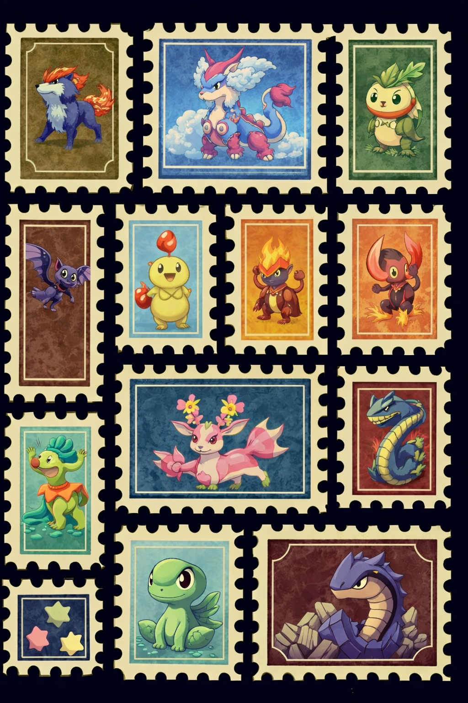

# PokeGAN
Pokemon Generator using LSGAN
This notebook implements and trains a Generative Adversarial Network (GAN) to generate Pokémon images. The GAN consists of a Generator and a Discriminator, designed to learn the distribution of real Pokémon images and generate new, similar images.

Key Components:

Dataset Loading: Loads a dataset of Pokémon images from /content/drive/My Drive/EIP/PokeGAN/data/.
Generator Model: A Generator network (defined in OVsihbPZMx1z) that takes a latent vector z as input and outputs a synthetic Pokémon image.
Discriminator Model: A Discriminator network (defined in OVsihbPZMx1z) that attempts to distinguish between real Pokémon images and images generated by the Generator.
Training Loop: The GAN class (defined in I0uY7qpPKxJT) orchestrates the training process, alternating between training the Discriminator and the Generator using a Least Squares GAN (LSGAN) approach.
Hyperparameters: Key training parameters such as learning rate, batch size, and number of epochs are defined in R4sGRQWjLfZ1.
Checkpointing: The model periodically saves and restores checkpoints to /content/drive/My Drive/EIP/PokeGAN/output/pokegan.pt.
Visualization: During training, the notebook visualizes generated images and plots the Generator and Discriminator losses.
Execution Flow:

Setup: Imports necessary libraries and sets up paths and hyperparameters.
Data Preparation: Loads and preprocesses the Pokémon image dataset.
Model Definition: Defines the Generator and Discriminator architectures.
GAN Training: Initializes and trains the GAN model for a specified number of epochs.
Evaluation: Visualizes generated images and loss curves after training.

### Generated Pokemons

